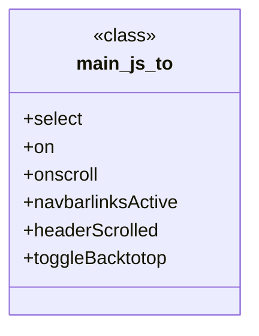

# Polyglot Codebase Knowledge Graph

> Generated offline by **readmenator**. 2 files, 7 symbols, 8 imports. Supports C, C++, Python, Go, Rust, JS/TS, Java, C#, Shell, PHP, Dart, GDScript, Nim, ASM, Ruby, Swift, Kotlin, Scala, Lua, Elixir.
> No LLMs. No tokens. Pure static analysis. See more [here](https://github.com/grisuno/ReadMenator)

**Start here:** Statistics Dashboard for scope, God Nodes for blast radius, Architecture Reference for per-file API. Agents: prefer `readmenator-agent/INDEX.md` + `SYMBOLS.md`.

**Wiki:** prefer `readmenator-wiki/index.md` for progressive disclosure: one synthesis page per community, `connections.json` with EXTRACTED vs INFERRED confidence, `queries.md` log, `REPORT.md` audit.

**Confidence:** EXTRACTED = parsed from source, INFERRED = heuristic bridge, AMBIGUOUS = reported, never hidden. See `readmenator-wiki/REPORT.md`.

**Total Files Parsed:** 2 | **Total Symbols Extracted:** 7 | **Total Imports:** 8

<!-- ranking_model: v1.0 | weights: {ppr:0.45,auth:0.2,test:0.15,doc:0.1,fresh:0.1} | alpha:0.85 | commit:b3ca3bb | date:2026-07-18 -->


## Table of Contents

1. [Statistics Dashboard](#statistics-dashboard)
2. [Architectural Layers](#architectural-layers)
3. [Ranked Context](#ranked-context)
4. [God Nodes](#god-nodes)
5. [Suggested Questions](#suggested-questions)
6. [Hotspot Analysis](#hotspot-analysis)
7. [Change Impact Analysis](#change-impact-analysis)
8. [Suggested Linting Rules](#suggested-linting-rules)
9. [Orphans](#orphans)
10. [Query Recipes](#query-recipes)
11. [Structural Knowledge Map](#structural-knowledge-map)
12. [UML Class Diagram](#uml-class-diagram)
13. [Code Property Graph](#code-property-graph)
14. [Architecture Reference](#architecture-reference)
    - [JS (2 files)](#js-2-files)

---

## Statistics Dashboard

| Metric | Value |
|--------|-------|
| Total Files | 2 |
| Total Symbols | 7 |
| Total Imports | 8 |
| Call Edges | 188 |
| Inheritance Edges | 0 |
| Languages | 1 |
| Avg Symbols/File | 3.5 |
| Avg Imports/File | 4.0 |

### Top Files by Import Count (Fan-Out)

| File | Imports | Symbols | Language |
|------|---------|---------|----------|
| `index.js` | 8 | 0 | js |

---

## Architectural Layers

Auto-detected from path patterns, naming conventions, and imported frameworks.

| Layer | Files |
|-------|-------|
| presentation | 1 |
| utility | 1 |

### presentation

- `index.js` (js, 0 symbols)

### utility

- `main.js` (js, 7 symbols)

---

## Ranked Context

Files ranked by composite score for the current query context. The ranking combines Personalized PageRank (query relevance), global authority, test coverage, documentation coverage, and code freshness. Model: v1.0.

| Rank | File | Composite | PPR | Authority | Test | Doc |
|------|------|-----------|-----|-----------|------|-----|
| 1 | `main.js` | 0.0429 | 0.0000 | 0.0000 | 0.00 | 0.43 |
| 2 | `index.js` | 0.0000 | 0.0000 | 0.0000 | 0.00 | 0.00 |

---

## God Nodes

Most architecturally central files ranked by combined import/export degree and symbol richness.

| File | Score | Connections | PageRank |
|------|-------|-------------|----------|
| `main.js` | 0.7 | | 0.0000 |
| `index.js` | 0.0 | | 0.0000 |

---

## Suggested Questions

Auto-generated exploration prompts based on graph structure:

- What does main.js depend on, and what depends on it? (0 connections)
- What does index.js depend on, and what depends on it? (0 connections)
- What is to in main.js and how is it used?
- What is the overall architecture of this codebase?

---

## Hotspot Analysis

Files ranked by combined complexity (symbol count) and centrality (connection count). High-scoring files are architecturally critical and may need refactoring attention.

| File | Complexity | Centrality | Combined | Symbols | Connections |
|------|-----------|------------|----------|---------|-------------|
| `main.js` | 1.000 | 0.371 | 0.622 | 7 | 53 |
| `index.js` | 0.000 | 1.000 | 0.600 | 0 | 143 |

---

## Change Impact Analysis

Files sorted by how many other files would be affected if they changed. High-impact files should be changed with caution.

| File | Direct Dependents | Transitive Dependents | Total Impact |
|------|------------------|----------------------|--------------|
| `index.js` | 0 | 0 | 0 |
| `main.js` | 0 | 0 | 0 |

---

## Suggested Linting Rules

Automatically suggested linting and security rules based on patterns detected in the codebase. These can be exported as Semgrep rules using the `--export-rules` flag.

| Rule ID | Severity | Description | Language | Matches |
|---------|----------|-------------|----------|---------|
| `RM001` | info | Large number of functions in js: 6 total | js | 6 |

---

## Orphans

Files with no documentation or low connectivity. These are candidates for documentation investment or cleanup.

- `index.js` (0 symbols, no doc)

---

## Query Recipes

Example queries you can run against this knowledge base using the ranking engine:

```
# Find files most relevant to a concept
readmenator query "Where is the import resolver implemented?"

# Rank files by relevance to a topic
readmenator query "How does documentation generation work?"

# Explain why a file ranks highly
readmenator query "explain readmenator/_documentation.py"

# Trace dependency paths with ranked context
readmenator query "path from CLI to exporter"
```

The ranking model uses the following signals:

- **Personalized PageRank** (45% weight): query-specific relevance via seed propagation
- **Global Authority** (20% weight): structural importance via standard PageRank
- **Test Coverage** (15% weight): fraction of symbols referenced in test files
- **Doc Coverage** (10% weight): presence of docstrings and file-level docs
- **Freshness** (10% weight): recent modification activity

Results include score decomposition and justification paths for each ranked item.

---

## Structural Knowledge Map


---

## UML Class Diagram

Auto-generated Mermaid class diagram from parsed class-level symbols. Shows classes, structs, interfaces, traits, and their methods with inheritance and dependency relationships.



---

## Code Property Graph

Machine-readable Code Property Graph (CPG) in JSON-LD format. This block allows AI agents to parse the full structural graph without additional file reads. Compatible with GraphRAG pipelines.

```json
{"@context": "https://schema.org", "analysis": {"communities": [], "god_nodes": [{"node_id": "public/assets/js/main.js", "score": 0.7}, {"node_id": "index.js", "score": 0.0}], "surprising_connections": []}, "edges": [{"confidence": "EXTRACTED", "relation": "imports", "source": "index.js", "target": "express"}, {"confidence": "EXTRACTED", "relation": "imports", "source": "index.js", "target": "path"}, {"confidence": "EXTRACTED", "relation": "imports", "source": "index.js", "target": "sqlite3"}, {"confidence": "EXTRACTED", "relation": "imports", "source": "index.js", "target": "body-parser"}, {"confidence": "EXTRACTED", "relation": "imports", "source": "index.js", "target": "express-session"}, {"confidence": "EXTRACTED", "relation": "imports", "source": "index.js", "target": "pg"}, {"confidence": "EXTRACTED", "relation": "imports", "source": "index.js", "target": "url"}, {"confidence": "EXTRACTED", "relation": "imports", "source": "index.js", "target": "ejs"}, {"confidence": "EXTRACTED", "relation": "calls", "source": "index.js", "target": "require"}, {"confidence": "EXTRACTED", "relation": "calls", "source": "index.js", "target": "require"}, {"confidence": "EXTRACTED", "relation": "calls", "source": "index.js", "target": "require"}, {"confidence": "EXTRACTED", "relation": "calls", "source": "index.js", "target": "verbose"}, {"confidence": "EXTRACTED", "relation": "calls", "source": "index.js", "target": "require"}, {"confidence": "EXTRACTED", "relation": "calls", "source": "index.js", "target": "require"}, {"confidence": "EXTRACTED", "relation": "calls", "source": "index.js", "target": "express"}, {"confidence": "EXTRACTED", "relation": "calls", "source": "index.js", "target": "require"}, {"confidence": "EXTRACTED", "relation": "calls", "source": "index.js", "target": "require"}, {"confidence": "EXTRACTED", "relation": "calls", "source": "index.js", "target": "use"}, {"confidence": "EXTRACTED", "relation": "calls", "source": "index.js", "target": "serialize"}, {"confidence": "EXTRACTED", "relation": "calls", "source": "index.js", "target": "run"}, {"confidence": "EXTRACTED", "relation": "calls", "source": "index.js", "target": "serialize"}, {"confidence": "EXTRACTED", "relation": "calls", "source": "index.js", "target": "run"}, {"confidence": "EXTRACTED", "relation": "calls", "source": "index.js", "target": "use"}, {"confidence": "EXTRACTED", "relation": "calls", "source": "index.js", "target": "use"}, {"confidence": "EXTRACTED", "relation": "calls", "source": "index.js", "target": "set"}, {"confidence": "EXTRACTED", "relation": "calls", "source": "index.js", "target": "engine"}, {"confidence": "EXTRACTED", "relation": "calls", "source": "index.js", "target": "set"}, {"confidence": "EXTRACTED", "relation": "calls", "source": "index.js", "target": "use"}, {"confidence": "EXTRACTED", "relation": "calls", "source": "index.js", "target": "get"}, {"confidence": "EXTRACTED", "relation": "calls", "source": "index.js", "target": "render"}, {"confidence": "EXTRACTED", "relation": "calls", "source": "index.js", "target": "redirect"}, {"confidence": "EXTRACTED", "relation": "calls", "source": "index.js", "target": "get"}, {"confidence": "EXTRACTED", "relation": "calls", "source": "index.js", "target": "render"}, {"confidence": "EXTRACTED", "relation": "calls", "source": "index.js", "target": "get"}, {"confidence": "EXTRACTED", "relation": "calls", "source": "index.js", "target": "render"}, {"confidence": "EXTRACTED", "relation": "calls", "source": "index.js", "target": "get"}, {"confidence": "EXTRACTED", "relation": "calls", "source": "index.js", "target": "render"}, {"confidence": "EXTRACTED", "relation": "calls", "source": "index.js", "target": "get"}, {"confidence": "EXTRACTED", "relation": "calls", "source": "index.js", "target": "render"}, {"confidence": "EXTRACTED", "relation": "calls", "source": "index.js", "target": "get"}, {"confidence": "EXTRACTED", "relation": "calls", "source": "index.js", "target": "render"}, {"confidence": "EXTRACTED", "relation": "calls", "source": "index.js", "target": "get"}, {"confidence": "EXTRACTED", "relation": "calls", "source": "index.js", "target": "render"}, {"confidence": "EXTRACTED", "relation": "calls", "source": "index.js", "target": "get"}, {"confidence": "EXTRACTED", "relation": "calls", "source": "index.js", "target": "render"}, {"confidence": "EXTRACTED", "relation": "calls", "source": "index.js", "target": "get"}, {"confidence": "EXTRACTED", "relation": "calls", "source": "index.js", "target": "render"}, {"confidence": "EXTRACTED", "relation": "calls", "source": "index.js", "target": "get"}, {"confidence": "EXTRACTED", "relation": "calls", "source": "index.js", "target": "render"}, {"confidence": "EXTRACTED", "relation": "calls", "source": "index.js", "target": "get"}, {"confidence": "EXTRACTED", "relation": "calls", "source": "index.js", "target": "render"}, {"confidence": "EXTRACTED", "relation": "calls", "source": "index.js", "target": "get"}, {"confidence": "EXTRACTED", "relation": "calls", "source": "index.js", "target": "render"}, {"confidence": "EXTRACTED", "relation": "calls", "source": "index.js", "target": "get"}, {"confidence": "EXTRACTED", "relation": "calls", "source": "index.js", "target": "render"}, {"confidence": "EXTRACTED", "relation": "calls", "source": "index.js", "target": "get"}, {"confidence": "EXTRACTED", "relation": "calls", "source": "index.js", "target": "render"}, {"confidence": "EXTRACTED", "relation": "calls", "source": "index.js", "target": "get"}, {"confidence": "EXTRACTED", "relation": "calls", "source": "index.js", "target": "render"}, {"confidence": "EXTRACTED", "relation": "calls", "source": "index.js", "target": "get"}, {"confidence": "EXTRACTED", "relation": "calls", "source": "index.js", "target": "render"}, {"confidence": "EXTRACTED", "relation": "calls", "source": "index.js", "target": "get"}, {"confidence": "EXTRACTED", "relation": "calls", "source": "index.js", "target": "render"}, {"confidence": "EXTRACTED", "relation": "calls", "source": "index.js", "target": "get"}, {"confidence": "EXTRACTED", "relation": "calls", "source": "index.js", "target": "render"}, {"confidence": "EXTRACTED", "relation": "calls", "source": "index.js", "target": "get"}, {"confidence": "EXTRACTED", "relation": "calls", "source": "index.js", "target": "render"}, {"confidence": "EXTRACTED", "relation": "calls", "source": "index.js", "target": "get"}, {"confidence": "EXTRACTED", "relation": "calls", "source": "index.js", "target": "render"}, {"confidence": "EXTRACTED", "relation": "calls", "source": "index.js", "target": "get"}, {"confidence": "EXTRACTED", "relation": "calls", "source": "index.js", "target": "render"}, {"confidence": "EXTRACTED", "relation": "calls", "source": "index.js", "target": "get"}, {"confidence": "EXTRACTED", "relation": "calls", "source": "index.js", "target": "render"}, {"confidence": "EXTRACTED", "relation": "calls", "source": "index.js", "target": "get"}, {"confidence": "EXTRACTED", "relation": "calls", "source": "index.js", "target": "render"}, {"confidence": "EXTRACTED", "relation": "calls", "source": "index.js", "target": "get"}, {"confidence": "EXTRACTED", "relation": "calls", "source": "index.js", "target": "render"}, {"confidence": "EXTRACTED", "relation": "calls", "source": "index.js", "target": "get"}, {"confidence": "EXTRACTED", "relation": "calls", "source": "index.js", "target": "render"}, {"confidence": "EXTRACTED", "relation": "calls", "source": "index.js", "target": "get"}, {"confidence": "EXTRACTED", "relation": "calls", "source": "index.js", "target": "render"}, {"confidence": "EXTRACTED", "relation": "calls", "source": "index.js", "target": "get"}, {"confidence": "EXTRACTED", "relation": "calls", "source": "index.js", "target": "render"}, {"confidence": "EXTRACTED", "relation": "calls", "source": "index.js", "target": "get"}, {"confidence": "EXTRACTED", "relation": "calls", "source": "index.js", "target": "render"}, {"confidence": "EXTRACTED", "relation": "calls", "source": "index.js", "target": "get"}, {"confidence": "EXTRACTED", "relation": "calls", "source": "index.js", "target": "render"}, {"confidence": "EXTRACTED", "relation": "calls", "source": "index.js", "target": "get"}, {"confidence": "EXTRACTED", "relation": "calls", "source": "index.js", "target": "render"}, {"confidence": "EXTRACTED", "relation": "calls", "source": "index.js", "target": "get"}, {"confidence": "EXTRACTED", "relation": "calls", "source": "index.js", "target": "render"}, {"confidence": "EXTRACTED", "relation": "calls", "source": "index.js", "target": "get"}, {"confidence": "EXTRACTED", "relation": "calls", "source": "index.js", "target": "all"}, {"confidence": "EXTRACTED", "relation": "calls", "source": "index.js", "target": "error"}, {"confidence": "EXTRACTED", "relation": "calls", "source": "index.js", "target": "sendStatus"}, {"confidence": "EXTRACTED", "relation": "calls", "source": "index.js", "target": "render"}, {"confidence": "EXTRACTED", "relation": "calls", "source": "index.js", "target": "redirect"}, {"confidence": "EXTRACTED", "relation": "calls", "source": "index.js", "target": "get"}, {"confidence": "EXTRACTED", "relation": "calls", "source": "index.js", "target": "all"}, {"confidence": "EXTRACTED", "relation": "calls", "source": "index.js", "target": "error"}, {"confidence": "EXTRACTED", "relation": "calls", "source": "index.js", "target": "sendStatus"}, {"confidence": "EXTRACTED", "relation": "calls", "source": "index.js", "target": "render"}, {"confidence": "EXTRACTED", "relation": "calls", "source": "index.js", "target": "redirect"}, {"confidence": "EXTRACTED", "relation": "calls", "source": "index.js", "target": "get"}, {"confidence": "EXTRACTED", "relation": "calls", "source": "index.js", "target": "render"}, {"confidence": "EXTRACTED", "relation": "calls", "source": "index.js", "target": "redirect"}, {"confidence": "EXTRACTED", "relation": "calls", "source": "index.js", "target": "post"}, {"confidence": "EXTRACTED", "relation": "calls", "source": "index.js", "target": "get"}, {"confidence": "EXTRACTED", "relation": "calls", "source": "index.js", "target": "error"}, {"confidence": "EXTRACTED", "relation": "calls", "source": "index.js", "target": "sendStatus"}, {"confidence": "EXTRACTED", "relation": "calls", "source": "index.js", "target": "redirect"}, {"confidence": "EXTRACTED", "relation": "calls", "source": "index.js", "target": "redirect"}, {"confidence": "EXTRACTED", "relation": "calls", "source": "index.js", "target": "post"}, {"confidence": "EXTRACTED", "relation": "calls", "source": "index.js", "target": "get"}, {"confidence": "EXTRACTED", "relation": "calls", "source": "index.js", "target": "error"}, {"confidence": "EXTRACTED", "relation": "calls", "source": "index.js", "target": "sendStatus"}, {"confidence": "EXTRACTED", "relation": "calls", "source": "index.js", "target": "redirect"}, {"confidence": "EXTRACTED", "relation": "calls", "source": "index.js", "target": "run"}, {"confidence": "EXTRACTED", "relation": "calls", "source": "index.js", "target": "function"}, {"confidence": "EXTRACTED", "relation": "calls", "source": "index.js", "target": "error"}, {"confidence": "EXTRACTED", "relation": "calls", "source": "index.js", "target": "sendStatus"}, {"confidence": "EXTRACTED", "relation": "calls", "source": "index.js", "target": "redirect"}, {"confidence": "EXTRACTED", "relation": "calls", "source": "index.js", "target": "post"}, {"confidence": "EXTRACTED", "relation": "calls", "source": "index.js", "target": "toISOString"}, {"confidence": "EXTRACTED", "relation": "calls", "source": "index.js", "target": "toISOString"}, {"confidence": "EXTRACTED", "relation": "calls", "source": "index.js", "target": "run"}, {"confidence": "EXTRACTED", "relation": "calls", "source": "index.js", "target": "function"}, {"confidence": "EXTRACTED", "relation": "calls", "source": "index.js", "target": "error"}, {"confidence": "EXTRACTED", "relation": "calls", "source": "index.js", "target": "sendStatus"}, {"confidence": "EXTRACTED", "relation": "calls", "source": "index.js", "target": "get"}, {"confidence": "EXTRACTED", "relation": "calls", "source": "index.js", "target": "error"}, {"confidence": "EXTRACTED", "relation": "calls", "source": "index.js", "target": "sendStatus"}, {"confidence": "EXTRACTED", "relation": "calls", "source": "index.js", "target": "sendStatus"}, {"confidence": "EXTRACTED", "relation": "calls", "source": "index.js", "target": "get"}, {"confidence": "EXTRACTED", "relation": "calls", "source": "index.js", "target": "all"}, {"confidence": "EXTRACTED", "relation": "calls", "source": "index.js", "target": "error"}, {"confidence": "EXTRACTED", "relation": "calls", "source": "index.js", "target": "sendStatus"}, {"confidence": "EXTRACTED", "relation": "calls", "source": "index.js", "target": "json"}, {"confidence": "EXTRACTED", "relation": "calls", "source": "index.js", "target": "use"}, {"confidence": "EXTRACTED", "relation": "calls", "source": "index.js", "target": "status"}, {"confidence": "EXTRACTED", "relation": "calls", "source": "index.js", "target": "send"}, {"confidence": "EXTRACTED", "relation": "calls", "source": "index.js", "target": "listen"}, {"confidence": "EXTRACTED", "relation": "calls", "source": "index.js", "target": "log"}, {"confidence": "EXTRACTED", "relation": "calls", "source": "public/assets/js/main.js", "target": "function"}, {"confidence": "EXTRACTED", "relation": "calls", "source": "public/assets/js/main.js", "target": "trim"}, {"confidence": "EXTRACTED", "relation": "calls", "source": "public/assets/js/main.js", "target": "querySelectorAll"}, {"confidence": "EXTRACTED", "relation": "calls", "source": "public/assets/js/main.js", "target": "querySelector"}, {"confidence": "EXTRACTED", "relation": "calls", "source": "public/assets/js/main.js", "target": "select"}, {"confidence": "EXTRACTED", "relation": "calls", "source": "public/assets/js/main.js", "target": "forEach"}, {"confidence": "EXTRACTED", "relation": "calls", "source": "public/assets/js/main.js", "target": "select"}, {"confidence": "EXTRACTED", "relation": "calls", "source": "public/assets/js/main.js", "target": "addEventListener"}, {"confidence": "EXTRACTED", "relation": "calls", "source": "public/assets/js/main.js", "target": "addEventListener"}, {"confidence": "EXTRACTED", "relation": "calls", "source": "public/assets/js/main.js", "target": "select"}, {"confidence": "EXTRACTED", "relation": "calls", "source": "public/assets/js/main.js", "target": "toggle"}, {"confidence": "EXTRACTED", "relation": "calls", "source": "public/assets/js/main.js", "target": "select"}, {"confidence": "EXTRACTED", "relation": "calls", "source": "public/assets/js/main.js", "target": "toggle"}, {"confidence": "EXTRACTED", "relation": "calls", "source": "public/assets/js/main.js", "target": "select"}, {"confidence": "EXTRACTED", "relation": "calls", "source": "public/assets/js/main.js", "target": "forEach"}, {"confidence": "EXTRACTED", "relation": "calls", "source": "public/assets/js/main.js", "target": "select"}, {"confidence": "EXTRACTED", "relation": "calls", "source": "public/assets/js/main.js", "target": "add"}, {"confidence": "EXTRACTED", "relation": "calls", "source": "public/assets/js/main.js", "target": "remove"}, {"confidence": "EXTRACTED", "relation": "calls", "source": "public/assets/js/main.js", "target": "addEventListener"}, {"confidence": "EXTRACTED", "relation": "calls", "source": "public/assets/js/main.js", "target": "onscroll"}, {"confidence": "EXTRACTED", "relation": "calls", "source": "public/assets/js/main.js", "target": "select"}, {"confidence": "EXTRACTED", "relation": "calls", "source": "public/assets/js/main.js", "target": "add"}, {"confidence": "EXTRACTED", "relation": "calls", "source": "public/assets/js/main.js", "target": "remove"}, {"confidence": "EXTRACTED", "relation": "calls", "source": "public/assets/js/main.js", "target": "addEventListener"}, {"confidence": "EXTRACTED", "relation": "calls", "source": "public/assets/js/main.js", "target": "onscroll"}, {"confidence": "EXTRACTED", "relation": "calls", "source": "public/assets/js/main.js", "target": "select"}, {"confidence": "EXTRACTED", "relation": "calls", "source": "public/assets/js/main.js", "target": "add"}, {"confidence": "EXTRACTED", "relation": "calls", "source": "public/assets/js/main.js", "target": "remove"}, {"confidence": "EXTRACTED", "relation": "calls", "source": "public/assets/js/main.js", "target": "addEventListener"}, {"confidence": "EXTRACTED", "relation": "calls", "source": "public/assets/js/main.js", "target": "onscroll"}, {"confidence": "EXTRACTED", "relation": "calls", "source": "public/assets/js/main.js", "target": "call"}, {"confidence": "EXTRACTED", "relation": "calls", "source": "public/assets/js/main.js", "target": "map"}, {"confidence": "EXTRACTED", "relation": "calls", "source": "public/assets/js/main.js", "target": "matchMedia"}, {"confidence": "EXTRACTED", "relation": "calls", "source": "public/assets/js/main.js", "target": "matchMedia"}, {"confidence": "EXTRACTED", "relation": "calls", "source": "public/assets/js/main.js", "target": "init"}, {"confidence": "EXTRACTED", "relation": "calls", "source": "public/assets/js/main.js", "target": "callback"}, {"confidence": "EXTRACTED", "relation": "calls", "source": "public/assets/js/main.js", "target": "callback"}, {"confidence": "EXTRACTED", "relation": "calls", "source": "public/assets/js/main.js", "target": "callback"}, {"confidence": "EXTRACTED", "relation": "calls", "source": "public/assets/js/main.js", "target": "querySelectorAll"}, {"confidence": "EXTRACTED", "relation": "calls", "source": "public/assets/js/main.js", "target": "call"}, {"confidence": "EXTRACTED", "relation": "calls", "source": "public/assets/js/main.js", "target": "forEach"}, {"confidence": "EXTRACTED", "relation": "calls", "source": "public/assets/js/main.js", "target": "addEventListener"}, {"confidence": "EXTRACTED", "relation": "calls", "source": "public/assets/js/main.js", "target": "preventDefault"}, {"confidence": "EXTRACTED", "relation": "calls", "source": "public/assets/js/main.js", "target": "stopPropagation"}, {"confidence": "EXTRACTED", "relation": "calls", "source": "public/assets/js/main.js", "target": "add"}, {"confidence": "EXTRACTED", "relation": "calls", "source": "public/assets/js/main.js", "target": "select"}, {"confidence": "EXTRACTED", "relation": "calls", "source": "public/assets/js/main.js", "target": "forEach"}, {"confidence": "EXTRACTED", "relation": "calls", "source": "public/assets/js/main.js", "target": "select"}, {"confidence": "EXTRACTED", "relation": "calls", "source": "public/assets/js/main.js", "target": "setTimeout"}, {"confidence": "EXTRACTED", "relation": "calls", "source": "public/assets/js/main.js", "target": "select"}, {"confidence": "EXTRACTED", "relation": "calls", "source": "public/assets/js/main.js", "target": "forEach"}, {"confidence": "EXTRACTED", "relation": "calls", "source": "public/assets/js/main.js", "target": "resize"}, {"confidence": "EXTRACTED", "relation": "calls", "source": "public/assets/js/main.js", "target": "observe"}], "generator": "readmenator", "metadata": {"edge_count": 196, "file_count": 2, "language_count": 1, "symbol_count": 7}, "nodes": [{"id": "index.js", "kind": "module", "label": "index.js", "language": "js", "sha256": "7df64a783412261d", "symbol_count": 0, "symbols": []}, {"id": "public/assets/js/main.js", "kind": "module", "label": "main.js", "language": "js", "sha256": "390d69348b0837ce", "symbol_count": 7, "symbols": [{"doc": "Easy selector helper function", "kind": "function", "line": 14, "name": "select"}, {"doc": "Easy event listener function", "kind": "function", "line": 26, "name": "on"}, {"doc": "Easy on scroll event listener", "kind": "function", "line": 37, "name": "onscroll"}, {"kind": "function", "line": 63, "name": "navbarlinksActive"}, {"kind": "function", "line": 84, "name": "headerScrolled"}, {"kind": "function", "line": 100, "name": "toggleBacktotop"}, {"kind": "class", "line": 80, "name": "to"}]}], "type": "CodePropertyGraph", "version": "1.0"}
```

---

## Architecture Reference

### JS (2 files)

#### `index.js`
**Path:** `index.js`

*No symbols extracted*

#### `main.js`
**Path:** `public/assets/js/main.js`

**Classes:**
- `to` (line 80)

**Functions:**
- `select` (line 14) - *Easy selector helper function*
- `on` (line 26) - *Easy event listener function*
- `onscroll` (line 37) - *Easy on scroll event listener*
- `navbarlinksActive` (line 63)
- `headerScrolled` (line 84)
- `toggleBacktotop` (line 100)
