# Polyglot Codebase Knowledge Graph

> Generated offline by **readmenator**. Supports C, C++, Python, Go, Rust, JS/TS, Java, C#, Shell, PHP, Dart, GDScript, Nim, ASM.
> No LLMs. No tokens. Pure static analysis.

**Total Files Parsed:** 2 | **Total Symbols Extracted:** 7 | **Total Imports:** 8

## Structural Knowledge Map

```mermaid
graph TD
    classDef mod fill:#1e1e1e,stroke:#ff6666,stroke-width:2px,color:#fff;
    classDef cls fill:#2d2d2d,stroke:#4ec9b0,stroke-width:2px,color:#fff;
    classDef fn fill:#333,stroke:#dcdcaa,stroke-width:1px,color:#dcdcaa;
    classDef ext fill:#111,stroke:#666,stroke-dasharray: 5 5,color:#aaa;
    index_js["index.js (js)"]
    class index_js mod;
    public_assets_js_main_js["main.js (js)"]
    class public_assets_js_main_js mod;
    public_assets_js_main_js_select["select"]
    class public_assets_js_main_js_select fn;
    public_assets_js_main_js --> public_assets_js_main_js_select
    public_assets_js_main_js_on["on"]
    class public_assets_js_main_js_on fn;
    public_assets_js_main_js --> public_assets_js_main_js_on
    public_assets_js_main_js_onscroll["onscroll"]
    class public_assets_js_main_js_onscroll fn;
    public_assets_js_main_js --> public_assets_js_main_js_onscroll
    public_assets_js_main_js_navbarlinksActive["navbarlinksActive"]
    class public_assets_js_main_js_navbarlinksActive fn;
    public_assets_js_main_js --> public_assets_js_main_js_navbarlinksActive
    public_assets_js_main_js_headerScrolled["headerScrolled"]
    class public_assets_js_main_js_headerScrolled fn;
    public_assets_js_main_js --> public_assets_js_main_js_headerScrolled
    ext_express["express"]
    class ext_express ext;
    index_js -.->|imports| ext_express
    ext_path["path"]
    class ext_path ext;
    index_js -.->|imports| ext_path
    ext_sqlite3["sqlite3"]
    class ext_sqlite3 ext;
    index_js -.->|imports| ext_sqlite3
    ext_body_parser["body-parser"]
    class ext_body_parser ext;
    index_js -.->|imports| ext_body_parser
    ext_express_session["express-session"]
    class ext_express_session ext;
    index_js -.->|imports| ext_express_session
    ext_pg["pg"]
    class ext_pg ext;
    index_js -.->|imports| ext_pg
    ext_url["url"]
    class ext_url ext;
    index_js -.->|imports| ext_url
    ext_ejs["ejs"]
    class ext_ejs ext;
    index_js -.->|imports| ext_ejs
```

---

## Architecture Reference

### JS (2 files)

#### `index.js`
**Path:** `index.js`

*No symbols extracted*

#### `main.js`
**Path:** `public/assets/js/main.js`

**Classs:**
- `to` (line 80)

**Functions:**
- `select` (line 14) - *Easy selector helper function*
- `on` (line 26) - *Easy event listener function*
- `onscroll` (line 37) - *Easy on scroll event listener*
- `navbarlinksActive` (line 63)
- `headerScrolled` (line 84)
- `toggleBacktotop` (line 100)
